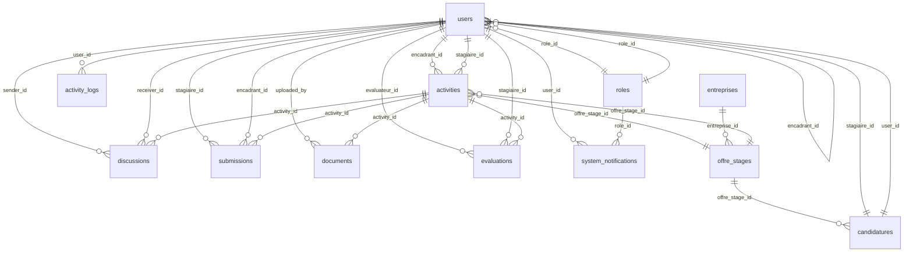

# Schéma des Relations de la Base de Données

## Vue d'ensemble des tables et leurs relations

### Tables principales


## Détail des relations par table

### 1. users (Utilisateurs)
- **role_id** (FK) -> roles.id
- **encadrant_id** (FK) -> users.id (auto-référence pour double encadrement)
- **offre_stage_id** (FK) -> offre_stages.id (pour les stagiaires)

### 2. roles (Rôles)
- **Relations sortantes** : users, system_notifications

### 3. activities (Activités)
- **encadrant_id** (FK) -> users.id
- **stagiaire_id** (FK) -> users.id
- **offre_stage_id** (FK) -> offre_stages.id
- **Relations sortantes** : discussions, submissions, documents, evaluations

### 4. discussions (Discussions)
- **activity_id** (FK) -> activities.id
- **sender_id** (FK) -> users.id
- **receiver_id** (FK) -> users.id

### 5. submissions (Soumissions)
- **activity_id** (FK) -> activities.id
- **stagiaire_id** (FK) -> users.id
- **encadrant_id** (FK) -> users.id

### 6. documents (Documents)
- **activity_id** (FK) -> activities.id
- **uploaded_by** (FK) -> users.id

### 7. evaluations (Évaluations)
- **activity_id** (FK) -> activities.id
- **evaluateur_id** (FK) -> users.id
- **stagiaire_id** (FK) -> users.id

### 8. entreprises (Entreprises)
- **Relations sortantes** : offre_stages

### 9. offre_stages (Offres de stage)
- **entreprise_id** (FK) -> entreprises.id
- **rh_id** (FK) -> users.id
- **Relations sortantes** : candidatures, activities, users

### 10. candidatures (Candidatures)
- **offre_stage_id** (FK) -> offre_stages.id
- **stagiaire_id** (FK) -> users.id
- **user_id** (FK) -> users.id

### 11. system_notifications (Notifications système)
- **role_id** (FK) -> roles.id
- **user_id** (FK) -> users.id

### 12. activity_logs (Logs d'activité)
- **user_id** (FK) -> users.id

### 13. notifications (Notifications)
- *Table existante avec structure à vérifier*

## Contraintes d'intégrité

### Foreign Keys avec CASCADE DELETE
- activities.encadrant_id -> users.id (CASCADE)
- activities.stagiaire_id -> users.id (CASCADE)
- discussions.activity_id -> activities.id (CASCADE)
- discussions.sender_id -> users.id (CASCADE)
- discussions.receiver_id -> users.id (CASCADE)
- submissions.activity_id -> activities.id (CASCADE)
- documents.activity_id -> activities.id (CASCADE)
- evaluations.activity_id -> activities.id (CASCADE)
- offre_stages.entreprise_id -> entreprises.id (CASCADE)
- candidatures.offre_stage_id -> offre_stages.id (CASCADE)

### Foreign Keys avec SET NULL
- users.encadrant_id -> users.id (SET NULL)
- users.role_id -> roles.id (SET NULL)
- submissions.encadrant_id -> users.id (SET NULL)
- candidatures.stagiaire_id -> users.id (SET NULL)
- system_notifications.user_id -> users.id (SET NULL)
- system_notifications.role_id -> roles.id (SET NULL)
- activity_logs.user_id -> users.id (SET NULL)

## Index recommandés pour les performances

### Tables avec fort volume de données
```sql
-- discussions
CREATE INDEX idx_discussions_activity_created ON discussions(activity_id, created_at);
CREATE INDEX idx_discussions_receiver_read ON discussions(receiver_id, read);

-- activities
CREATE INDEX idx_activities_statut_encadrant ON activities(statut, encadrant_id);
CREATE INDEX idx_activities_stagiaire_statut ON activities(stagiaire_id, statut);

-- submissions
CREATE INDEX idx_submissions_activity_statut ON submissions(activity_id, statut);
CREATE INDEX idx_submissions_stagiaire_date ON submissions(stagiaire_id, date_soumission);

-- candidatures
CREATE INDEX idx_candidatures_statut_offre ON candidatures(statut, offre_stage_id);
CREATE INDEX idx_candidatures_email_offre ON candidatures(email, offre_stage_id);

-- activity_logs
CREATE INDEX idx_activity_logs_user_created ON activity_logs(user_id, created_at);
CREATE INDEX idx_activity_logs_model ON activity_logs(model_type, model_id);
```

## Validation des données

### Enums et contraintes
- **activities.statut** : 'proposee', 'assignee', 'en_cours', 'soumise', 'validee', 'refusee', 'terminee'
- **activities.priorite** : 'basse', 'moyenne', 'haute', 'urgente'
- **discussions.type** : 'message', 'refus', 'acceptation', 'demande_info', 'evaluation'
- **submissions.type** : 'rapport', 'presentation', 'code', 'autre'
- **submissions.statut** : 'soumis', 'en_revision', 'valide', 'refuse'
- **system_notifications.type** : 'info', 'success', 'warning', 'error'
- **system_notifications.niveau** : 'global', 'role', 'user'

### Champs obligatoires
- **users** : name, email, password
- **activities** : titre, description, encadrant_id
- **discussions** : activity_id, sender_id, receiver_id, message
- **entreprises** : nom, adresse, ville, code_postal, pays, telephone
- **offre_stages** : titre, description, missions, lieu, duree_semaines, entreprise_id, rh_id

## Notes importantes pour le développement

1. **Ordre des migrations** : Toujours créer les tables de référence avant les tables qui les utilisent
2. **Soft deletes** : Considérer l'ajout de `deleted_at` sur les tables critiques
3. **Timestamps** : Toutes les tables doivent avoir `created_at` et `updated_at`
4. **Audit trail** : La table `activity_logs` permet de tracer toutes les modifications
5. **Performance** : Les index sont essentiels pour les tables avec beaucoup de relations
