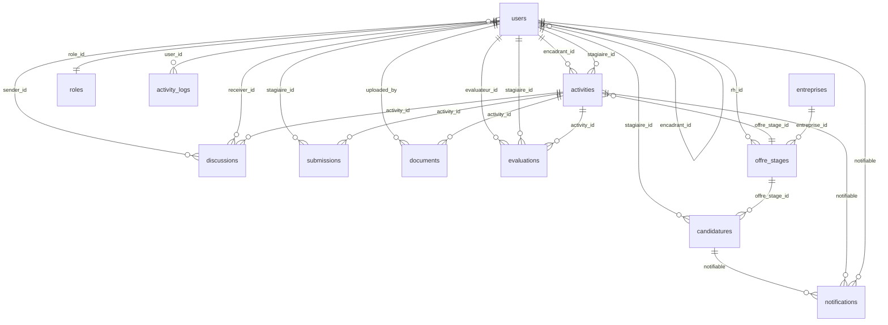

# Guide Complet des Migrations - Système de Gestion de Stages

## Vue d'ensemble

Ce guide présente toutes les migrations nécessaires pour le système complet de gestion de stages, avec 12 tables principales couvrant tous les aspects du processus.

## Liste Complète des Tables

### 1. Tables de Base du Système

#### `users` (0001_01_01_000001)
- **Rôle** : Table centrale des utilisateurs
- **Champs** : nom, prénom, email, password, date_naissance, téléphone, adresse, photo_path
- **Relations** : role_id, encadrant_id, encadrant_faculte_id, encadrant_entreprise_id, offre_stage_id
- **Fonctionnalités** : Multi-encadrement, profils complets, planning

#### `roles` (0001_01_01_000002)
- **Rôle** : Gestion des rôles et permissions
- **Champs** : name, description, permissions (JSON), active
- **Rôles par défaut** : admin, rh, encadrant, stagiaire
- **Fonctionnalités** : Système de permissions flexible

### 2. Tables de Gestion des Stages

#### `entreprises` (0001_01_01_000003)
- **Rôle** : Gestion des entreprises partenaires
- **Champs** : nom, description, secteur_activite, adresse complète, logo_path, conditions_stage
- **Fonctionnalités** : Conditions internes, règlement, statut actif/inactif

#### `offre_stages` (0001_01_01_000004)
- **Rôle** : Catalogue des offres de stage
- **Champs** : titre, description, missions, lieu, durée, rémunération, type_stage
- **Types de stage** : entreprise, pfe, initiation, perfectionnement, benefolat
- **Relations** : entreprise_id, rh_id
- **Fonctionnalités** : Workflow brouillon->publié->clôturé

#### `candidatures` (0001_01_01_000005)
- **Rôle** : Gestion complète des candidatures
- **Champs** : infos personnelles, formation, documents, entretien, statut
- **Documents** : CV, lettre motivation, portfolio
- **Workflow** : reçu->en cours->accepté/refusé
- **Fonctionnalités** : Archivage, notifications SMS, création compte stagiaire

### 3. Tables de Suivi des Activités

#### `activities` (0001_01_01_000006)
- **Rôle** : Planification et suivi des activités de stage
- **Champs** : titre, description, objectifs, statut, priorité, dates, progression
- **Statuts** : proposée, assignée, en cours, soumise, validée, refusée, terminée
- **Relations** : encadrant_id, stagiaire_id, offre_stage_id, user_id
- **Fonctionnalités** : Suivi progression, dates importantes, livrables

#### `submissions` (0001_01_01_000007)
- **Rôle** : Soumissions de documents par les stagiaires
- **Champs** : titre, fichier_path, type, statut, note, commentaires
- **Types** : rapport, presentation, code, autre
- **Workflow** : soumis->en révision->validé/refusé
- **Fonctionnalités** : Évaluation, notation, feedback

#### `documents` (0001_01_01_000008)
- **Rôle** : Bibliothèque de documents partagés
- **Champs** : titre, description, fichier_path, type, statut
- **Types** : support, ressource, modèle, autre
- **Relations** : activity_id, uploaded_by
- **Fonctionnalités** : Supports pédagogiques, ressources partagées

#### `evaluations` (0001_01_01_000009)
- **Rôle** : Évaluations complètes des stagiaires
- **Champs** : notes (technique, comportement, générale), commentaires, critères
- **Workflow** : brouillon->soumise->validée
- **Relations** : activity_id, evaluateur_id, stagiaire_id
- **Fonctionnalités** : Évaluation multi-critères, feedback détaillé

### 4. Tables de Communication

#### `discussions` (0001_01_01_000010)
- **Rôle** : Messagerie et notifications
- **Champs** : message, type, read, activity_id (optionnel)
- **Types** : message, refus, acceptation, demande_info, evaluation
- **Relations** : sender_id, receiver_id, activity_id
- **Fonctionnalités** : Discussion temps réel, notifications automatiques

#### `notifications` (0001_01_01_000011)
- **Rôle** : Système de notifications (Email/SMS)
- **Champs** : sujet, contenu, type, destinataire, statut
- **Types** : email, sms, system
- **Relations** : Polymorphique (notifiable)
- **Fonctionnalités** : Notifications multi-canaux, historique

### 5. Tables d'Audit

#### `activity_logs` (0001_01_01_000012)
- **Rôle** : Journal d'audit et traçabilité
- **Champs** : action, description, niveau, métadonnées
- **Actions** : create, update, delete, login, logout, etc.
- **Relations** : user_id, modèle polymorphique
- **Fonctionnalités** : Audit complet, traçabilité des modifications

## Schéma des Relations



## Ordre d'Exécution Recommandé

Les migrations sont déjà numérotées dans le bon ordre chronologique :

1. **0001_01_01_000001** - users (table de base)
2. **0001_01_01_000002** - roles (dépend de users)
3. **0001_01_01_000003** - entreprises (indépendante)
4. **0001_01_01_000004** - offre_stages (dépend de users, entreprises)
5. **0001_01_01_000005** - candidatures (dépend de offre_stages, users)
6. **0001_01_01_000006** - activities (dépend de users, offre_stages)
7. **0001_01_01_000007** - submissions (dépend de activities, users)
8. **0001_01_01_000008** - documents (dépend de activities, users)
9. **0001_01_01_000009** - evaluations (dépend de activities, users)
10. **0001_01_01_000010** - discussions (dépend de activities, users)
11. **0001_01_01_000011** - notifications (polymorphique)
12. **0001_01_01_000012** - activity_logs (dépend de users)

## Commandes d'Utilisation

### Installation complète
```bash
# Nettoyer les anciennes migrations
php artisan migrate:fresh

# Exécuter les nouvelles migrations
php artisan migrate

# Insérer les données de base
php artisan db:seed
```

### Vérification
```bash
# Vérifier l'état des migrations
php artisan migrate:status

# Voir la structure de la base
php artisan schema:dump
```

### Développement
```bash
# Créer une nouvelle migration
php artisan make:migration create_nom_table

# Revenir en arrière
php artisan migrate:rollback --step=1
```

## Index Recommandés pour Performance

Les migrations incluent déjà les index essentiels. Pour une utilisation intensive, considérez :

```sql
-- Requêtes fréquentes sur les discussions
CREATE INDEX idx_discussions_complex ON discussions(receiver_id, read, created_at);

-- Recherche d'activités par statut et date
CREATE INDEX idx_activities_dates ON activities(statut, date_debut, date_limite);

-- Historique des candidatures
CREATE INDEX idx_candidatures_dates ON candidatures(statut, created_at, date_decision);
```

## Données de Base (Seeders)

Les migrations incluent l'insertion des rôles par défaut. Créez des seeders pour :

- Utilisateurs de démonstration (admin, rh, encadrants, stagiaires)
- Entreprises exemples
- Offres de stage exemples
- Statuts et configurations par défaut

## Maintenance

- **Sauvegarde** : Avant toute modification de structure
- **Test** : Toujours tester les migrations en environnement de développement
- **Rollback** : Assurez-vous que les down() fonctionnent correctement
- **Documentation** : Mettez à jour ce guide lors de modifications

## Sécurité

- **Foreign keys** : CASCADE DELETE approprié pour maintenir l'intégrité
- **Indexes** : Optimisés pour les requêtes fréquentes
- **Soft deletes** : Considéré pour les tables critiques (archived_at)
- **Audit trail** : Table activity_logs pour traçabilité complète
